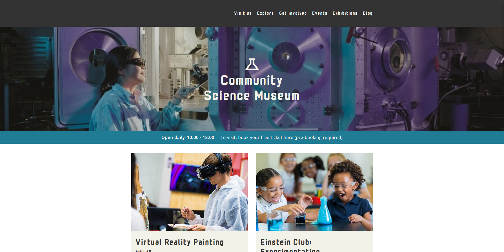

# Community Science Museum | Semester Project 1



## Description

Add a more detailed description of what your project entails and set out to do.

The site contains, among other things:
- a design responsive across different sized devices which also appeals to the target audience
- visible and clear navigation to navigate between multiple levels of pages
- semantic and neat HTML and CSS which follows the DRY principle

## Built With

This site is built with the following:

- HTML
- CSS

## Getting Started

### Installing

1. Open command window
2. Select project destination
3. Run:

```bash
git clone https://github.com/anneandersen92/semester-project.git
```

### Running

No requirements.

## Contributing
To contribute to the project, please do the following:

1. Fork the repository
2. Create a new branch from master:
```bash
git checkout -b new-contribution.
```
3. Make your changes.
4. Stage and Commit your changes:
```bash
git commit -am 'Add a relevant commit message'
```
5. Push to the branch:
```bash
git push origin new-contribution
```
6. Submit a pull request

## Contact

[My Email](mailto:anne_92@live.no?subject=OH%20Sheet%20inquiry)

[My LinkedIn page](https://www.linkedin.com/in/anne-andersen-7ba49b58)
